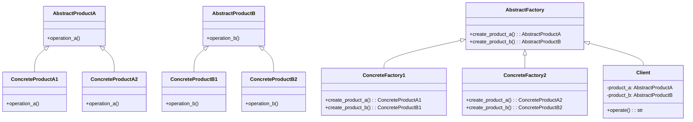

## Quick Summary

The Abstract Factory Design Pattern is a creational pattern that provides an interface for creating families of related or dependent objects without specifying their concrete classes. It falls under the Gang of Four (GoF) design patterns and promotes the concept of object composition over class inheritance. The pattern is particularly useful when a system must be independent of how its objects are created, composed, and represented.

## Python Code Example

```python
from abc import ABC, abstractmethod

# Abstract Product A
class AbstractProductA(ABC):
    @abstractmethod
    def operation_a(self):
        pass

# Concrete Product A1
class ConcreteProductA1(AbstractProductA):
    def operation_a(self):
        return "ConcreteProductA1 operation"

# Concrete Product A2
class ConcreteProductA2(AbstractProductA):
    def operation_a(self):
        return "ConcreteProductA2 operation"

# Abstract Product B
class AbstractProductB(ABC):
    @abstractmethod
    def operation_b(self):
        pass

# Concrete Product B1
class ConcreteProductB1(AbstractProductB):
    def operation_b(self):
        return "ConcreteProductB1 operation"

# Concrete Product B2
class ConcreteProductB2(AbstractProductB):
    def operation_b(self):
        return "ConcreteProductB2 operation"

# Abstract Factory
class AbstractFactory(ABC):
    @abstractmethod
    def create_product_a(self) -> AbstractProductA:
        pass
    
    @abstractmethod
    def create_product_b(self) -> AbstractProductB:
        pass

# Concrete Factory 1
class ConcreteFactory1(AbstractFactory):
    def create_product_a(self) -> AbstractProductA:
        return ConcreteProductA1()
    
    def create_product_b(self) -> AbstractProductB:
        return ConcreteProductB1()

# Concrete Factory 2
class ConcreteFactory2(AbstractFactory):
    def create_product_a(self) -> AbstractProductA:
        return ConcreteProductA2()
    
    def create_product_b(self) -> AbstractProductB:
        return ConcreteProductB2()

# Client
class Client:
    def __init__(self, abstract_factory: AbstractFactory):
        self.product_a = abstract_factory.create_product_a()
        self.product_b = abstract_factory.create_product_b()
    
    def operate(self):
        result_a = self.product_a.operation_a()
        result_b = self.product_b.operation_b()
        return f"{result_a} and {result_b}"

# Example usage
factory_1 = ConcreteFactory1()
client_1 = Client(factory_1)
result_1 = client_1.operate()
print(result_1)

factory_2 = ConcreteFactory2()
client_2 = Client(factory_2)
result_2 = client_2.operate()
print(result_2)
```
## Mermaid Diagram

