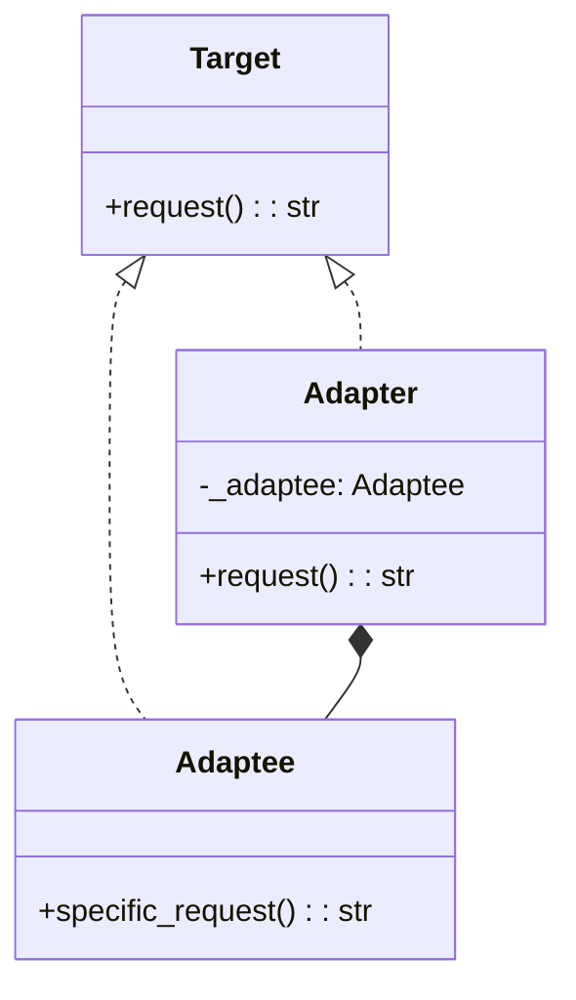

## Quick Summary

The Adapter Design Pattern is a structural pattern that allows incompatible interfaces to work together. It acts as a bridge between two incompatible interfaces, making them compatible without changing their existing code. This pattern involves a client, a target interface, an adapter, and an adaptee. The client interacts with the target interface, and the adapter, which implements the target interface, delegates the calls to the adaptee's interface. This enables objects with different interfaces to work together seamlessly.

## Python Code Example
```python
from abc import ABC, abstractmethod

# Target interface
class Target(ABC):
    @abstractmethod
    def request(self) -> str:
        pass

# Adaptee
class Adaptee:
    def specific_request(self) -> str:
        return "Adaptee's specific request"

# Adapter
class Adapter(Target):
    def __init__(self, adaptee: Adaptee):
        self._adaptee = adaptee

    def request(self) -> str:
        return f"Adapter: {self._adaptee.specific_request()}"

# Client
def client_code(target: Target) -> None:
    result = target.request()
    print(f"Client: {result}")

# Example usage
adaptee = Adaptee()
adapter = Adapter(adaptee)

client_code(adapter)
```

## Mermaid Diagram

