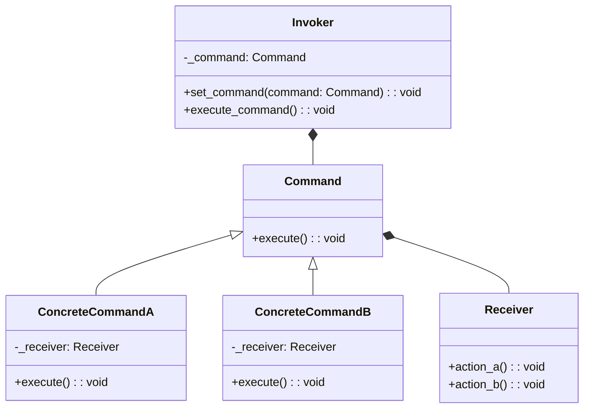

## Quick Summary

The Command Design Pattern is a behavioral pattern that turns a request into a stand-alone object, containing all information about the request. This transformation allows the parameterization of clients with different requests, queuing of requests, and logging of the parameters for the requests. It consists of four key components: Command, ConcreteCommand, Client, and Invoker. Commands encapsulate a request as an object, allowing clients to parameterize clients with queues, requests, and operations. Notably, the Command Pattern is often used to implement undo functionality, allowing for the reversal of previously executed commands.

## Python Code Example
```python
from abc import ABC, abstractmethod

# Command interface
class Command(ABC):
    @abstractmethod
    def execute(self) -> None:
        pass

# Concrete Command A
class ConcreteCommandA(Command):
    def __init__(self, receiver):
        self._receiver = receiver

    def execute(self) -> None:
        self._receiver.action_a()

# Concrete Command B
class ConcreteCommandB(Command):
    def __init__(self, receiver):
        self._receiver = receiver

    def execute(self) -> None:
        self._receiver.action_b()

# Receiver
class Receiver:
    def action_a(self) -> None:
        print("Receiver: Action A executed")

    def action_b(self) -> None:
        print("Receiver: Action B executed")

# Invoker
class Invoker:
    def __init__(self):
        self._command = None

    def set_command(self, command: Command) -> None:
        self._command = command

    def execute_command(self) -> None:
        self._command.execute()

# Client
receiver = Receiver()
command_a = ConcreteCommandA(receiver)
command_b = ConcreteCommandB(receiver)

invoker = Invoker()

invoker.set_command(command_a)
invoker.execute_command()

invoker.set_command(command_b)
invoker.execute_command()
```

## Mermaid Diagram

