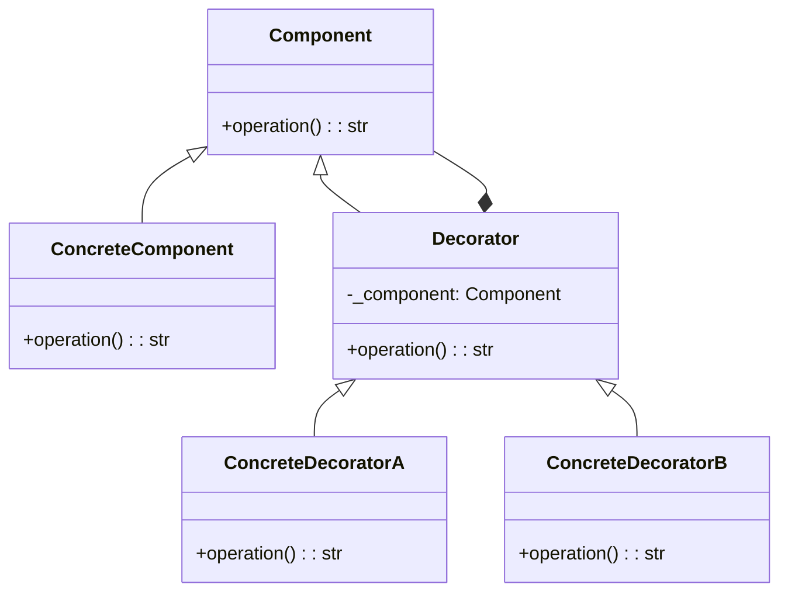

## Quick Summary

The Decorator Design Pattern is a structural pattern that allows behavior to be added to an individual object, either statically or dynamically, without affecting the behavior of other objects from the same class. It is achieved by creating a set of decorator classes that are used to wrap concrete components. This pattern follows the principle of "Attach additional responsibilities to an object dynamically."

## Python Code Example
```python
from abc import ABC, abstractmethod

# Component interface
class Component(ABC):
    @abstractmethod
    def operation(self) -> str:
        pass

# Concrete Component
class ConcreteComponent(Component):
    def operation(self) -> str:
        return "ConcreteComponent operation"

# Decorator
class Decorator(Component):
    def __init__(self, component: Component):
        self._component = component

    @abstractmethod
    def operation(self) -> str:
        pass

# Concrete Decorator A
class ConcreteDecoratorA(Decorator):
    def operation(self) -> str:
        return f"ConcreteDecoratorA operation, {self._component.operation()}"

# Concrete Decorator B
class ConcreteDecoratorB(Decorator):
    def operation(self) -> str:
        return f"ConcreteDecoratorB operation, {self._component.operation()}"

# Client
def client_code(component: Component) -> None:
    result = component.operation()
    print(f"Client: {result}")

# Example usage
simple_component = ConcreteComponent()
client_code(simple_component)

decorated_component_a = ConcreteDecoratorA(simple_component)
client_code(decorated_component_a)

decorated_component_b = ConcreteDecoratorB(decorated_component_a)
client_code(decorated_component_b)
```

## Mermaid Diagram

