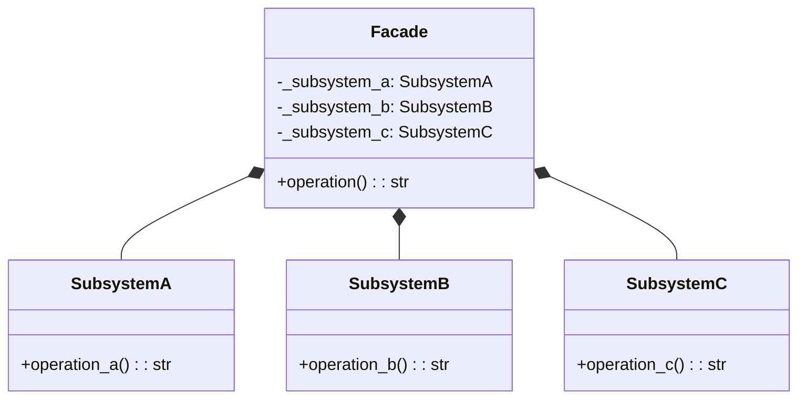

## Quick Summary

The Facade Design Pattern is a structural pattern that provides a simplified interface to a set of interfaces in a subsystem. It defines a higher-level interface that makes the subsystem easier to use. This pattern involves a facade class that encapsulates the complexity of the subsystem and provides a unified interface to the client. The Facade Design Pattern is used to simplify the interaction with a complex system by providing a single entry point.

## Python Code Example
```python
# Subsystem components
class SubsystemA:
    def operation_a(self) -> str:
        return "SubsystemA: operation_a"

class SubsystemB:
    def operation_b(self) -> str:
        return "SubsystemB: operation_b"

class SubsystemC:
    def operation_c(self) -> str:
        return "SubsystemC: operation_c"

# Facade
class Facade:
    def __init__(self):
        self._subsystem_a = SubsystemA()
        self._subsystem_b = SubsystemB()
        self._subsystem_c = SubsystemC()

    def operation(self) -> str:
        result = []
        result.append(self._subsystem_a.operation_a())
        result.append(self._subsystem_b.operation_b())
        result.append(self._subsystem_c.operation_c())
        return "\n".join(result)

# Client
def client_code(facade: Facade) -> None:
    result = facade.operation()
    print(f"Client: {result}")

# Example usage
facade = Facade()
client_code(facade)
```

## Mermaid Diagram

