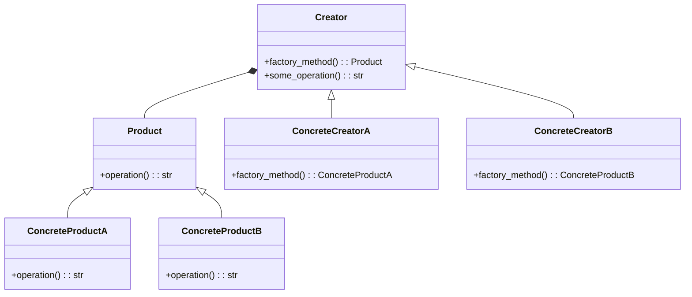

## Quick Summary

The Factory Method Design Pattern is a creational pattern that provides an interface for creating instances of a class but allows subclasses to alter the type of objects that will be created. It falls under the Gang of Four (GoF) design patterns and promotes the principle of "Define an interface for creating an object, but let subclasses alter the type of objects that will be created."

## Python Code Example
```python
from abc import ABC, abstractmethod

# Product interface
class Product(ABC):
    @abstractmethod
    def operation(self) -> str:
        pass

# Concrete Product A
class ConcreteProductA(Product):
    def operation(self) -> str:
        return "ConcreteProductA operation"

# Concrete Product B
class ConcreteProductB(Product):
    def operation(self) -> str:
        return "ConcreteProductB operation"

# Creator interface
class Creator(ABC):
    @abstractmethod
    def factory_method(self) -> Product:
        pass

    def some_operation(self) -> str:
        product = self.factory_method()
        result = f"Creator working with {product.operation()}"
        return result

# Concrete Creator A
class ConcreteCreatorA(Creator):
    def factory_method(self) -> Product:
        return ConcreteProductA()

# Concrete Creator B
class ConcreteCreatorB(Creator):
    def factory_method(self) -> Product:
        return ConcreteProductB()

# Client
def client_code(creator: Creator) -> None:
    print(f"Client: {creator.some_operation()}")


# Example usage
creator_a = ConcreteCreatorA()
client_code(creator_a)

creator_b = ConcreteCreatorB()
client_code(creator_b)
```
## Mermaid Diagram
