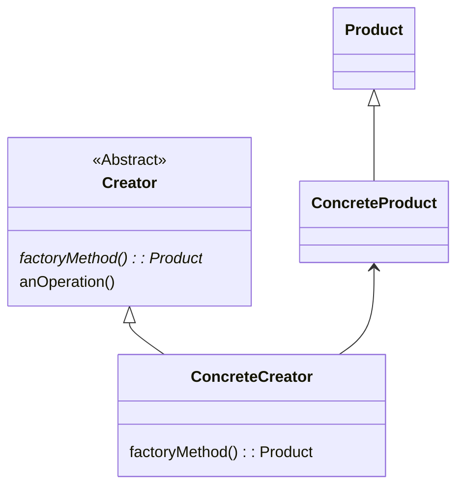

The factory method pattern defines an interface for creating an object, but lets subclasses decide which class to instantiate.  Factory method lets a class defer instantiation to subclasses.

```mermaid
classDiagram

	class Creator {

	<<Abstract>>

	factoryMethod()*: Product

	anOperation()

	}

	class ConcreteCreator {

	factoryMethod(): Product
	
	}

	class Product {

	}

	class ConcreteProduct {

	}

	Creator <|-- ConcreteCreator

	ConcreteProduct <-- ConcreteCreator

	Product <|-- ConcreteProduct
```

