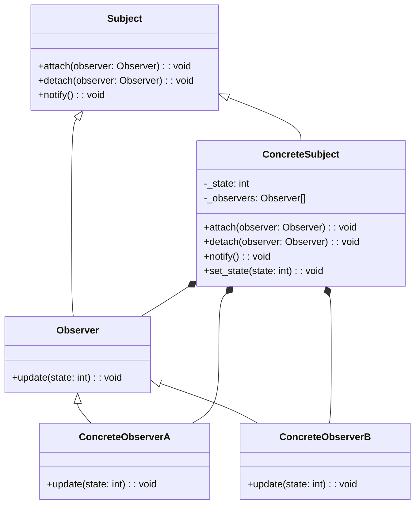

## Quick Summary

The Observer Design Pattern is a behavioral pattern that defines a one-to-many dependency between objects, so that when one object changes its state, all its dependents are notified and updated automatically. This pattern is useful for establishing a loose coupling between objects, where changes in one object trigger actions in other objects. The key components are the Subject, which maintains a list of observers, and the Observers, which register with and get notified by the Subject.

## Python Code Example
```python
from abc import ABC, abstractmethod
from typing import List

# Subject interface
class Subject(ABC):
    @abstractmethod
    def attach(self, observer: 'Observer') -> None:
        pass

    @abstractmethod
    def detach(self, observer: 'Observer') -> None:
        pass

    @abstractmethod
    def notify(self) -> None:
        pass

# Concrete Subject
class ConcreteSubject(Subject):
    _state: int = 0
    _observers: List['Observer'] = []

    def attach(self, observer: 'Observer') -> None:
        self._observers.append(observer)

    def detach(self, observer: 'Observer') -> None:
        self._observers.remove(observer)

    def notify(self) -> None:
        for observer in self._observers:
            observer.update(self._state)

    def set_state(self, state: int) -> None:
        self._state = state
        self.notify()

# Observer interface
class Observer(ABC):
    @abstractmethod
    def update(self, state: int) -> None:
        pass

# Concrete Observer A
class ConcreteObserverA(Observer):
    def update(self, state: int) -> None:
        print(f"ConcreteObserverA received update with state: {state}")

# Concrete Observer B
class ConcreteObserverB(Observer):
    def update(self, state: int) -> None:
        print(f"ConcreteObserverB received update with state: {state}")

# Example usage
subject = ConcreteSubject()
observer_a = ConcreteObserverA()
observer_b = ConcreteObserverB()

subject.attach(observer_a)
subject.attach(observer_b)

subject.set_state(1)
subject.set_state(2)

subject.detach(observer_a)

subject.set_state(3)
```

## Mermaid Diagram

