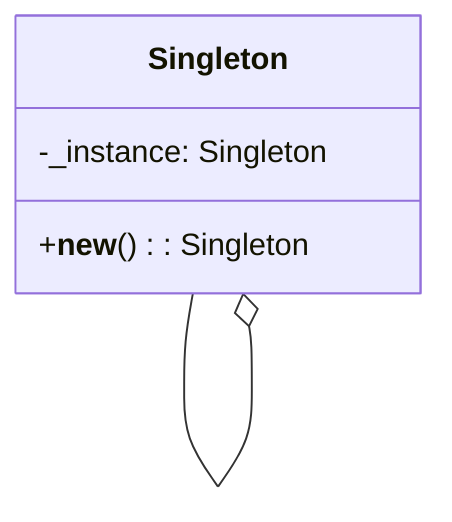

## Quick Summary

The Singleton Design Pattern is a creational pattern that ensures a class has only one instance and provides a global point of access to that instance. This pattern is useful when exactly one object is needed to coordinate actions across the system. It restricts the instantiation of a class to a single instance and provides a global point of access to that instance.

## Python Code Example
```python
class Singleton:
    _instance = None

    def __new__(cls):
        if cls._instance is None:
            cls._instance = super(Singleton, cls).__new__(cls)
        return cls._instance

# Example usage
singleton_instance_1 = Singleton()
singleton_instance_2 = Singleton()

print(singleton_instance_1 is singleton_instance_2)  # Output: True
```
## Mermaid Diagram

