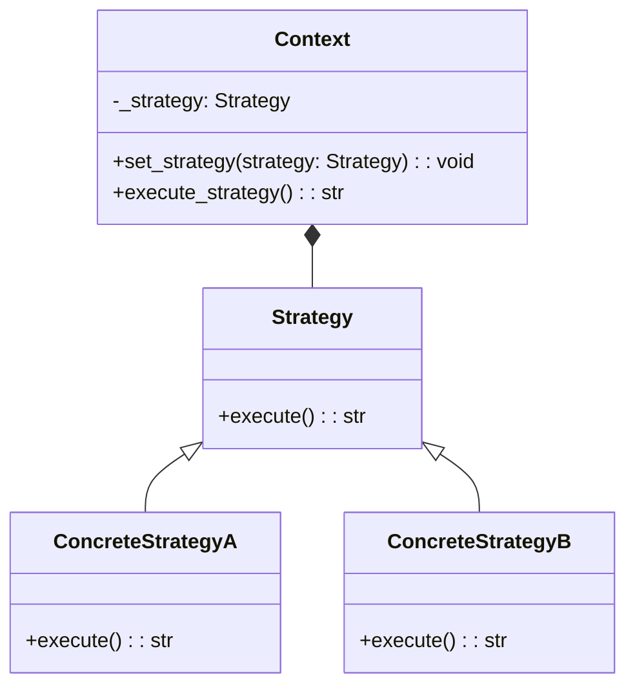

## Quick Summary

The Strategy Design Pattern is a behavioral pattern that defines a family of algorithms, encapsulates each algorithm, and makes them interchangeable. It lets the client choose the appropriate algorithm at runtime. This pattern follows the principle of "Define a family of algorithms, encapsulate each one, and make them interchangeable."

## Python Code Example
```python
from abc import ABC, abstractmethod

# Strategy interface
class Strategy(ABC):
    @abstractmethod
    def execute(self) -> str:
        pass

# Concrete Strategy A
class ConcreteStrategyA(Strategy):
    def execute(self) -> str:
        return "ConcreteStrategyA executed"

# Concrete Strategy B
class ConcreteStrategyB(Strategy):
    def execute(self) -> str:
        return "ConcreteStrategyB executed"

# Context
class Context:
    def __init__(self, strategy: Strategy):
        self._strategy = strategy

    def set_strategy(self, strategy: Strategy):
        self._strategy = strategy

    def execute_strategy(self) -> str:
        return self._strategy.execute()

# Client
def client_code(context: Context) -> None:
    result = context.execute_strategy()
    print(f"Client: {result}")

# Example usage
strategy_a = ConcreteStrategyA()
context = Context(strategy_a)
client_code(context)

strategy_b = ConcreteStrategyB()
context.set_strategy(strategy_b)
client_code(context)
```

## Mermaid Diagram

