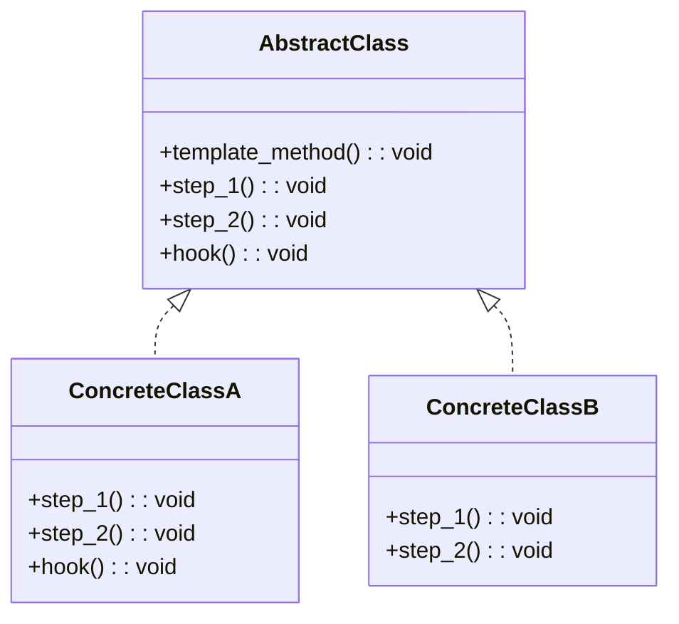

## Quick Summary

The Template Design Pattern is a behavioral pattern that defines the skeleton of an algorithm in the superclass but lets subclasses override specific steps of the algorithm without changing its structure. It provides a template method in the superclass, containing the algorithm's steps, and allows subclasses to implement or override specific parts of the algorithm. This pattern promotes code reuse and allows for variations in the algorithm without modifying its overall structure.
## Python Code Example
```python
from abc import ABC, abstractmethod

# Abstract Class with Template Method
class AbstractClass(ABC):
    def template_method(self) -> None:
        self.step_1()
        if self.hook():
	        self.step_2()

    @abstractmethod
    def step_1(self) -> None:
        pass

    @abstractmethod
    def step_2(self) -> None:
        pass

    def hook(self) -> bool:
        return True

# Concrete Class A
class ConcreteClassA(AbstractClass):
    def step_1(self) -> None:
        print("ConcreteClassA: Step 1 executed")

    def step_2(self) -> None:
        print("ConcreteClassA: Step 2 executed")

    def hook(self) -> bool:
        return False

# Concrete Class B
class ConcreteClassB(AbstractClass):
    def step_1(self) -> None:
        print("ConcreteClassB: Step 1 executed")

    def step_2(self) -> None:
        print("ConcreteClassB: Step 2 executed")

# Client
def client_code(abstract_class: AbstractClass) -> None:
    abstract_class.template_method()

# Example usage
concrete_class_a = ConcreteClassA()
client_code(concrete_class_a)

concrete_class_b = ConcreteClassB()
client_code(concrete_class_b)
```
## Mermaid Diagram

